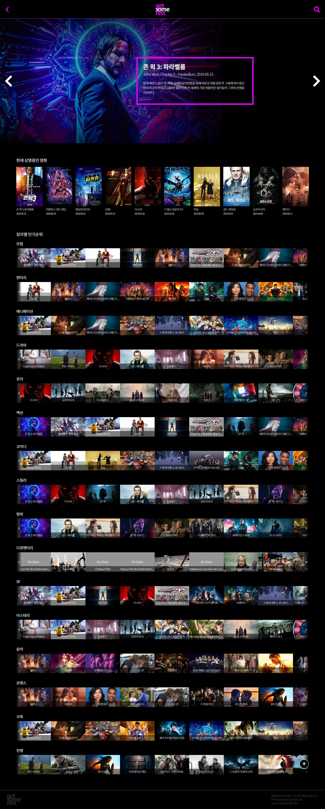
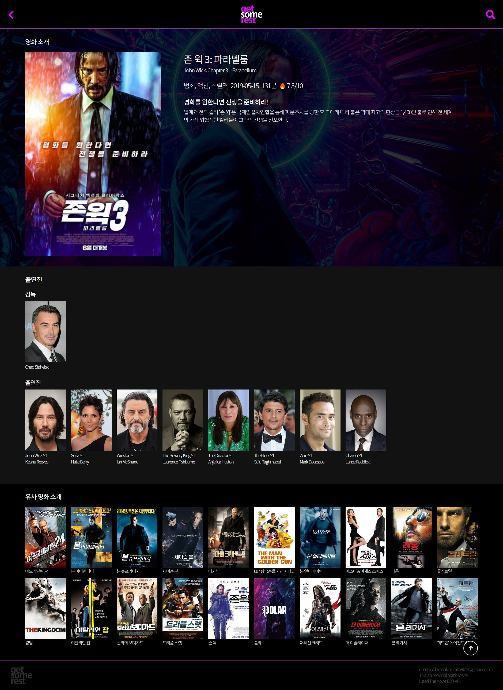
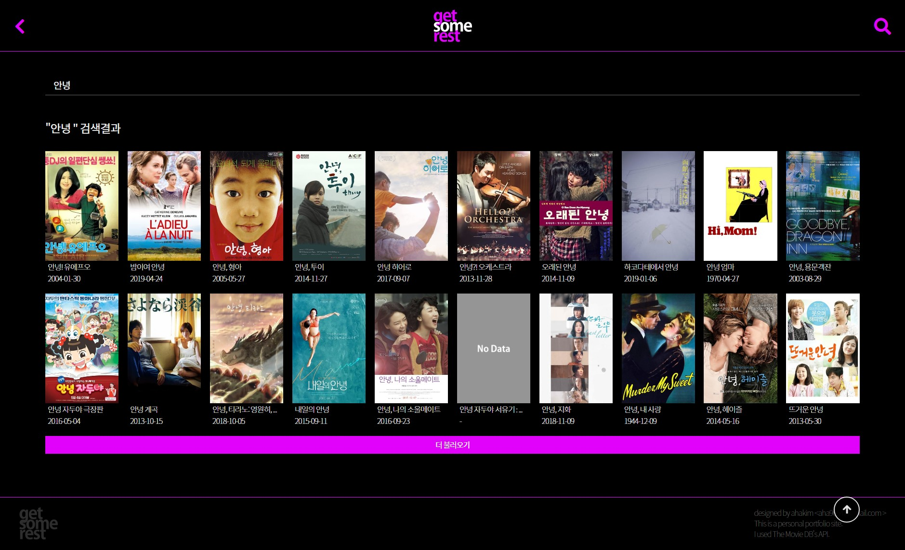
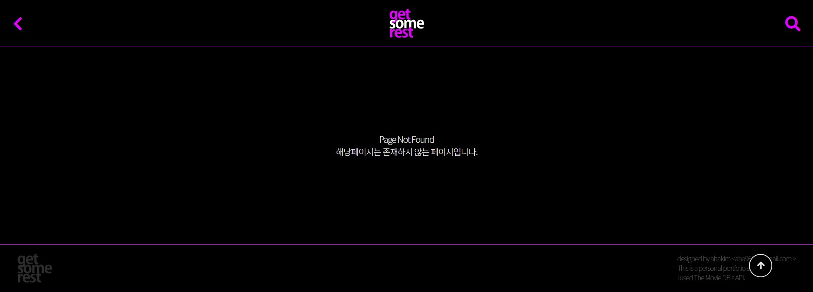

# [get some rest](https://may54ther.github.io/getSomeRest/dist/index.html)


<br/>

## 1. Skills
> - HTML, CSS
> - Vue.js, Vuex, Router 
> - Axios
> - API : [The Movie DB](https://www.themoviedb.org/)

<br/>

## 2. Pages
> - 2.1 메인
>    - 슬라이드: 인기영화
>    - Upcoming Movies
>    - 장르 별 영화
> - 2.2 영화-상세소개
>    - 영화 소개
>    - Cast: 감독, 배우
>    - 관련 영화
> - 2.3 영화-검색
>    - 검색
>    - 검색 결과
>    - 페이지 더 불러오기
> - 2.4 Not Found: 404

### 작업사항
> - 메인 💖
>    - ~~API 사용하여 데이터 불러오기~~ ✔
>    - ~~Design/CSS~~ ✔
>       - ~~인기영화~~ ✔
>       - ~~장르 별 영화~~ ✔
>    - ~~Slider 구현~~ ✔
>       - ~~인기영화~~ ✔
>       - ~~장르 별 영화~~ ✔
> - 영화-상세소개 💖
>    - ~~API 사용하여 데이터 불러오기~~ ✔
>    - ~~Design/CSS~~ ✔
>    - ~~영화 소개~~ ✔
>    - ~~Cast: 감독, 배우~~ ✔
>    - ~~관련 영화~~ ✔
> - ~~영화-검색~~ 💖
>    - ~~API 사용하여 데이터 불러오기~~ ✔
>    - ~~검색~~ ✔
>    - ~~검색 결과~~ ✔
>    - ~~페이지 더 불러오기~~ ✔
> - ~~Not Found: 404~~ 💖
>    - ~~Design/CSS~~ ✔
>    - ~~Router~~ ✔
> - 오류/추가/수정★★★
>    - ~~인기 영화 슬라이더 반응형(크기 변경시 슬라이드 위치ㅠㅠ)~~ ✔
>    - ~~포스터, 백드롭 사진 null 처리~~ ✔
>    - scrollTop 버튼을 일정 스크롤 이후부터 나타나도록 변경하기
>    - ~~영화 상세페이지에서 관련 영화를 누르면 주소는 변경되나 페이지 이동이 일어나지 않음~~ ✔
>    - 인기영화>슬라이더 자동슬라이더로 변경하기
>    - 데이터를 받아오기 전까지 loading 넣기

<br/>

## Screenshots
> ### 메인
> 
> ### 영화-상세소개
> 
> ### 영화-검색
> 
> ### 404 : Not Found
> 

<br/>

## 4. Project Setup
```
npm install
```

### - Compiles and hot-reloads for development
```
npm run serve
```

### - Compiles and minifies for production
```
npm run build
```

### - Run your tests
```
npm run test
```

### - Lints and fixes files
```
npm run lint
```

### - Customize configuration
See [Configuration Reference](https://cli.vuejs.org/config/).
